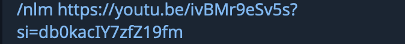
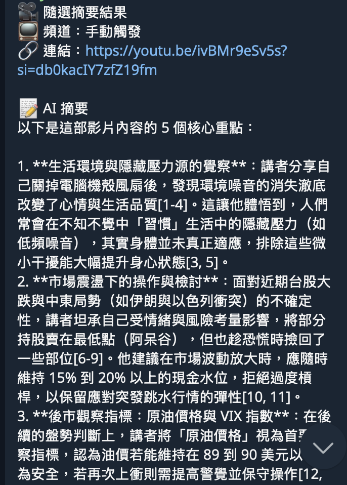
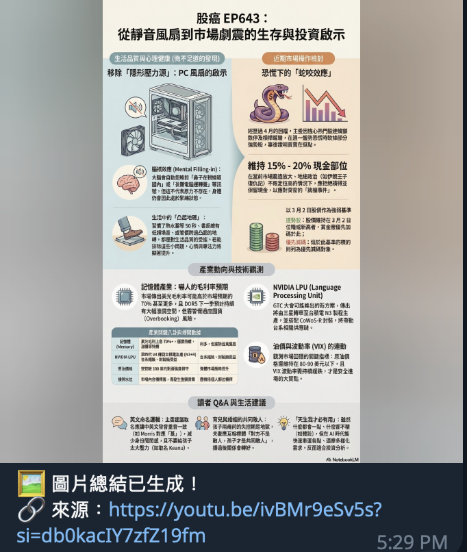
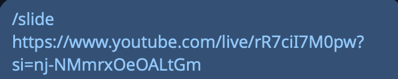
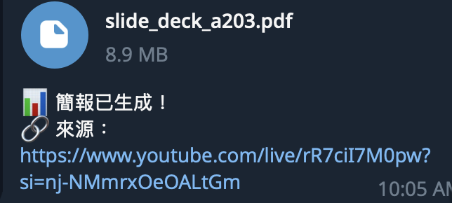

# 🤖 LAZYTUBE-ASSISTANT

<p align="center">
  <a href="README.md">繁體中文</a> | 
  <a href="README.zh-cn.md">简体中文</a> | 
  <a href="README.en.md">English</a>
</p>

> 🎉 **開發者告白！** 這是一個基於 **Google NotebookLM** 實現「完全零成本」營運的智慧影片摘要助理。

---

**LazyTube-Assistant** 讓你從此告別資訊焦慮。利用 GitHub Actions 的免費資源，24/7 自動監控、分析並推播您感興趣的內容精華。

## ✨ 功能特色

- **💸 零營運成本**：完全依賴 GitHub Actions 免費額度，實現真正的零開銷 AI 服務。
- **📦 免伺服器架構**：無需管理資料庫或複雜環境，只要 Fork 即可自動運行。
- **🧠 深度 AI 解析**：基於 Google NotebookLM，提供邏輯嚴密且具備上下文理解的摘要。
- **🎯 智慧內容過濾**：自動識別感興趣的內容（如：PoE 攻略、賽季更新），精確命中您的愛好。
- **🛡️ 安全隱私設計**：憑證僅在隔離容器中處理，數據直接傳送至 Google，隱私無虞。

## 🚀 兩種運作模式

### 1. 🤖 自動化追蹤 (懶人模式)
**「你不用動，AI 主動報告。」** 系統每小時會自動檢查您訂閱的頻道。若發現符合關鍵字（如：PoE, 賽季）的新影片，AI 會自動產出摘要並推送到您的 Telegram。
> **核心價值：** 確保您不漏掉任何重要的遊戲更新或教學，且不需親自翻閱 YouTube。

### 2. 📱 隨選摘要 (隨傳隨到)
**「看到好片，直接丟給 AI。」** 直接在 Telegram 對話框貼上任何 YouTube 網址，機器人會立即針對該影片進行深度分析並回傳重點。
> **核心價值：** 臨時看到感興趣的長影片，幾秒鐘內就能掌握核心精華。

---

## 📸 實際效果展示

### 📝 `/nlm` — AI 文字摘要
在 Telegram 輸入 `/nlm <YouTube 連結>`，機器人會呼叫 NotebookLM 分析影片內容，並以條列重點的方式回傳 AI 摘要。

| 指令輸入 | 摘要結果 |
|:---:|:---:|
|  |  |

---

### 🖼️ `/pic` — 圖解 Infographic
在 Telegram 輸入 `/pic <YouTube 連結>`，機器人會自動生成一張視覺化資訊圖，將影片重點以圖文並茂的方式呈現。

| 指令輸入 | Infographic 結果 |
|:---:|:---:|
|  |  |

---

### 📊 `/slide` — 簡報 PDF
在 Telegram 輸入 `/slide <YouTube 連結>`，機器人會將影片內容整理成一份可下載的簡報 PDF，適合分享與存檔。

| 指令輸入 | 簡報 PDF 結果 |
|:---:|:---:|
|  |  |

---


## 📦 快速上手

### 1. 點擊 Fork
點擊本儲存庫右上角的 **Fork** 按鈕，複製到您的個人帳號。

### 2. 取得憑證 (全自動助手)
我們提供了一個跨平台工具來處理最麻煩的認證步驟：
1. 本地執行 `nlm login --force` 確保登入。
2. 執行設定助手：
   ```bash
   pip install google-auth-oauthlib requests
   python setup_helper.py
   ```
   *(Windows 使用者？請參閱 [Windows 指南](WINDOWS_GUIDE.md))*
3. 腳本會自動完成授權並產出 **`.env`** 檔案。

### 3. 設定 GitHub Secrets
前往 GitHub `Settings > Secrets and variables > Actions`，對照 **`.env`** 填入內容。

## 🛠️ 運作原理

| 組件 | 角色說明 |
| :--- | :--- |
| **GitHub Actions** | 運算核心與自動化排程器 |
| **YouTube API** | 內容偵測與資訊檢索 |
| **NotebookLM** | 核心 AI 引擎（提供深度理解與摘要） |
| **Telegram Bot** | 您的私人互動入口與結果接收端 |

## ⚠️ 風險聲明與限制

- **非官方通訊協議**：本專案依賴模擬瀏覽器行為。若 Google 修改 NotebookLM 網頁結構，本工具可能需更新。
- **憑證時效性**：Cookie 通常維持 **2 至 4 週**。失效時請重新執行 `setup_helper.py`。
- **100% 隱私保護**：所有數據皆在隔離環境處理並直接傳送至 Google。

## ❤️ 特別鳴謝

本專案的核心認證與操作邏輯深受 **[notebooklm-mcp-cli](https://github.com/jacob-bd/notebooklm-mcp-cli)** 的啟發與支持。

特別感謝作者 **[Jacob Ben-David](https://github.com/jacob-bd)** 開發了如此強大的 MCP 協議工具，讓 AI 代理能以程式化方式操作 NotebookLM。

## 📜 授權協議
MIT License. Developed by Michael.
